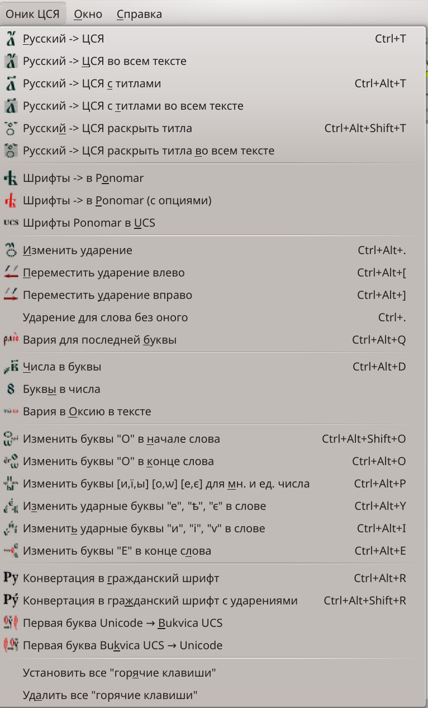

# Onik 

**1.2.7**

  

`Libre Office` расширение для текстов с церковно-славянским языком.  

### Общая информация о расширении
**В консольном и графическом вариантах:**

- Переводит текст с различными `Orthodox [UCS]` шрифтами в `Ponomar Unicode`.
- Переводит текст из `Ponomar Unicode` в `[UCS]` (с возможностью отделить надстрочники). 
- Переводит текст из современной (или смешанной) орфографии в церковно-славянскую (некоторые буквы, ударения, титла (выставить и раскрыть) и т.д.).  
- Меняет ударение в слове _(оксия, вария, камора, исо, апостроф)_.
- Перемещает **ударение** (циклически) вправо и влево.
- Преобразует числа в буквы и обратно _(в выделенном)_.
- Меняет буквы  `ѻ, о, ѡ, е` в начале и конце слова.
- Меняет _(циклично)_ ударные буквы `и, ї, ѵ` в словах  `ми́ръ`, `мі́ръ`, `мѵ́ро`.
- Меняет _(циклично)_ ударные буквы `е, ѣ, є`.
- Меняет _(циклично)_ буквы `[и,ї,ы]`, `[о,ѡ]`, `[е,є]` для мн. и ед. числа: <strong>-щимъ -щымъ;</strong> последняя `е ↔ є`; последняя `о ↔ ѡ` 
- Исправляет **варию** в конце слова на **оксию** _(перед частицами или краткими местоимениями)._ 
- Позволяет быстро выставить ударение в слово без оного (для скорости набора).
- Позволяет быстро выставить _варию_ в конец слова.
- Позволяет исправить некоторые ошибки набора.
- Позволяет быстро назначить и удалить _горячие клавиши_.
- Переводит текст из цся в гражданский шрифт.
- Замена первой буквы абзаца для шрифта `Bukvica UCS` и обратно.

**Для установки**  

Для `Linux` требуется установить компонент `LibreOffice`: `libreoffice-script-provider-python`  
`$ sudo apt-get install libreoffice-script-provider-python`  

**После установки**  

В `OOffice` конвертеры доступны через собственные меню и панель.  

Обрабатывается либо выделенный текст (доступно мультивыделение), либо весь открытый документ.

Из командной строки (например, для пакетной обработки) **ucs конвертер** может быть запущен подобным образом (необходимо указать полный путь к файлу):  
`$ soffice --invisible "macro:///OOnik.main.run_ucs_convert_py($PWD/$file_name.odt)"`  

#### Конвертеры для командной строки без использования LibreOffice 
В каталоге **utils** находятся python-скрипты:  
`onik_run.py`  
`onik_test.py`  
`convert_xml.py`

Для тестов или скриптов м.б. использованы py-скрипты с функциями обработки Ponomar-текста:  
`$ onik_run.py 'Фома'`  
`Ѳѡма̀`   
и текстовый фильтр:   
`$ echo 'Фома' |  onik_test.py`    
`Ѳѡма̀`

Текст можно получить также из файла (результат -> console):   
`$ onik_run.py -f $file_path`

##### UCS ↔ Unicode
`convert_xml.py`  
  
Запуск с различными опциями позволяет конвертировать текст `odt`-файла `UCS ↔ Unicode` с сохранением (или без) форматирования без использования `LibreOffice`, напрямую, через модуль `odfpy`. Результат сохраняется в новом файле.  
  
Пример использования (`Unicode → UCS`, с заменой шрифта в стилях на `Triodion`):  
`python convert_xml.py -s -f 'Triodion Ucs' -u 'D:/Temp/0104.odt'`  

Используя модуль `ConvertOdtByXML.py` в этом же каталоге, можно назначить различные конвертеры для обработки текстовых фрагментов. 

### Orthodox шрифты, доступные для конвертации:  
#### UCS

<ul>
<li>Akathistos Ucs    
<li>Hirmos Ucs
<li>Irmologion Ucs
<li>Pochaevsk Ucs
<li>Ostrog Ucs
<li>StaroUspenskaya Ucs
<li>Triodion Ucs
<li><i>и все недекоративные UCS-шрифты</i>   
</ul>  

#### Другие 
<ul>
<li>Hirmos Ponomar TT
<li>Irmologion
<li>Orthodox
<li>OrthodoxLoose
<li>OrthodoxDigits
<li>OrthodoxDigitsLoose
<li>Orthodox.tt Ucs8
<li>Orthodox.tt eRoos
<li>Ustav
<li>Valaam
</ul>

Конвертеры написаны для обработки большого количества документов, в которых церковно-славянские тексты набраны самыми различными (см. выше) ЦСЯ-шрифтами, и оформлены (орфографически) самыми разными способами.  

С `Unicode`-текстом удобно работать, назначив различным функциям "горячие клавиши".  

Расширение продолжает идею:
[https://extensions.libreoffice.org/extensions/church-slavonic-converter](https://extensions.libreoffice.org/extensions/church-slavonic-converter)

### Работа с инструментами  

#### Конвертация шрифтов

На панели доступны кнопки конвертации - автоматической, и с опциями _(на данный момент показыает список шрифтов, и конвертирует также в автоматическом режиме)._     
 &nbsp;&nbsp;   
     
  
#### Обработка текста со шрифтом Ponomar:

Перевод текста в современной орфографии в цся **(без титлов):**  
 - для слова под курсором или (мульти-) выделенного фрагмента `CTRL + T`.   
 - для всего текста.  

 То же **с титлами:**  
 - для слова под курсором или (мульти-) выделенного фрагмента `CTRL + ALT + T`.  
  - для всего текста.    

Раскрыть титла:  
 - для слова под курсором или (мульти-) выделенного фрагмента `CTRL + ALT + SHIFT + T`.  
 - для всего текста.  

Числа в буквы и обратно _(в выделенном фрагменте)_.  
&nbsp;&nbsp;     

Изменить ударение в слове под курсором  
_(циклически меняется оксия, вария, камора; исо и апостроф.
Учитываются `е` и `о`)_.  
  

Переместить ударение влево и вправо в слове под курсором _(циклически)_.  
Учитываются `е` и `о` для мн.ч.  
&nbsp;&nbsp;  

Установить варию для последней буквы (для скорости редактирования).   

Изменение вида букв `о` в начале слова, а также `е` и `о` в конце.  
&nbsp;&nbsp; &nbsp;&nbsp;   

Замена _(циклическая)_ ударных букв `и, ї, ѵ` в словах  `ми́ръ`, `мі́ръ`, `мѵ́ро`.  
   

Замена _(циклическая)_ ударных букв `е, ѣ, є`.  
  

Замена _(циклическая)_ букв `и, ї, ы` для мн. и ед. числа: <strong>-щимъ -щымъ.</strong>  
  

Конвертация в гражданский шрифт (с ударениями).   
&nbsp;&nbsp;   

Замена первой буквы абзаца для шрифта `Bukvica UCS`.  
&nbsp;&nbsp;  

В меню доступны пункты установки и удаления горячих клавиш.  

#### Горячие клавиши:  
* `CTRL + T` - Русский → ЦСЯ  
* `CTRL + ALT + T` - Русский → ЦСЯ с титлами  
* `CTRL + ALT + SHIFT + T` - Русский → ЦСЯ раскрыть титла  
  
* `CTRL + ALT + .` - Изменить ударение  
* `CTRL + ALT + [` - Переместить ударение влево  
* `CTRL + ALT + ]` - Переместить ударение вправо  
* `CTRL + .` - Ударение для слова без оного (у первой гласной)*    
* `CTRL + ALT + Q` - Вария для последней буквы  
  
* `CTRL + ALT + D` - Числа в буквы    
  
* `CTRL + ALT + SHIFT + O` - Изменить буквы `О` в начале слова  
* `CTRL + ALT + O` - Изменить буквы `О` в конце слова  
* `CTRL + ALT + P` - Изменить буквы `и`, `і`, `ы` для мн. и ед. числа  
* `CTRL + ALT + I` - Изменить ударные буквы `и`, `і`, `ѵ` в слове  
* `CTRL + ALT + Y` - Изменить ударные буквы `е`, `ѣ`, `є` в слове  
* `CTRL + ALT + E` - Изменить буквы `е`, `ѣ`, `є` в конце слова  

* `CTRL + ALT + R` - Конвертация в гражданский шрифт  
* `CTRL + ALT + SHIFT + R` - Конвертация в гражданский шрифт с ударениями  

\-----------  
`*` - *"Ударение для слова без оного":*  
при обработке уже набранного (обработанного предыдущими командами) текста, если в нем много слов без ударений, то для скорости редактирования, к примеру, при навигации к началу слова (по `Ctrl+->`), можно быстро выставить ударение для первой гласной `Ctrl+.` а после этого переместить его по гласным куда нужно `Ctrl+Alt+]` и `Ctrl+Alt+[`. 

При отсутствии ударения, сочетания `Ctrl+Alt+.`, `Ctrl+Alt+]` и `Ctrl+Alt+[` автоматически выставляют его для первой гласной и далее действуют по своей спецификации. Соответственно, `Ctrl+Alt+]` выставит ударение на второй гласной.      
  
Горячие клавиши можно изменять отдельно через обычное меню `Сервис|Настройка|Клавиатура`.  
  
  
#### Для текстов со смешанными языками:
`onik`-функции обрабатывают весь текст, независимо от языка (шрифта), как ЦСЯ. Если в тексте есть фрагменты на другом языке, можно сильно исказить текст. Отмена действий может не помочь. В подобных случаях необходимо пользоваться обработкой выделенного фрагмента.  

#### Перевод в гражданский шрифт:  
Реализован и для вспомогательных скриптов `onik_run.py` и `onik_test.py` с опцией `-r`.  
Доступна опция сохранения ударений `-R`.

#### Замена первой буквы абзаца для шрифта Bukvica UCS и обратно:
При замене первой буквы абзацные стили меняются автоматически, если в документе определены стили _(различие в кол-ве символов для буквицы):_  
**Для шрифта Bukvica UCS:**  
- Абзац с большой буквицей
- Абзац с большой буквицей и надстрочник
- Абзац с большой буквицей и два надстрочника  

**Для шрифта Ponomar Unicode:**  
- Абзац с буквицей
- Абзац с буквицей и надстрочник
- Абзац с буквицей и два надстрочника
 

#### Упрощенная сборка расширения
Скрипт [make_oxt.py](make_oxt.py) позволяет быстро пересобрать расширение, указав версию.   

#### Сборка расширения с помощью OOnik.odt
Для сборки нужно открыть этот файл в `LibreOffice` версии меньше `6`, включив макросы.  
Если нужно внести какие-то изменения в номер версии, добавить элементы меню и т.п. - 
открыть в редакторе макросов модуль `OOnik.odt|Standard|Module1`, внести изменения по образцу.  
В самом документе в оглавлении перейти в пункт `2.3.3 LibreOffice only` (стр. `9`),  
и скомпилировать расширение.

Скрипт [oxt_handler.sh](src/OOnik/oxt_handler.sh) при этом способе позволяет удалить из имени расширения суффикс вида `-L-VERSION` и получить `OOnik.oxt`

### Проблемы:  

#### При конвертации шрифтов:
- При работе с цветом и более сложным форматированием возможно придется либо убрать форматирование, либо обрабатывать через выделение.  
Решение: конвертация с помощью модуля ``utils/convert_xml.py``

#### При обработке текста:
- Текст обрабатывается регулярными выражениями, которые могут содержать разного рода неточности и ошибки. Поэтому после обработки возможны неверные ударения и замены букв.    

#### Общие:
- нет обработки текста в таблице (todo).
